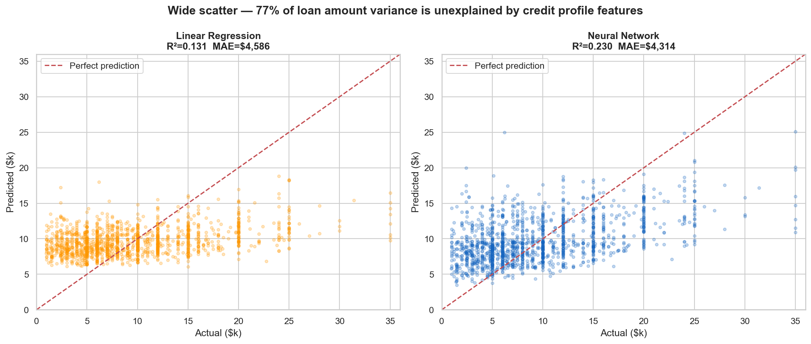
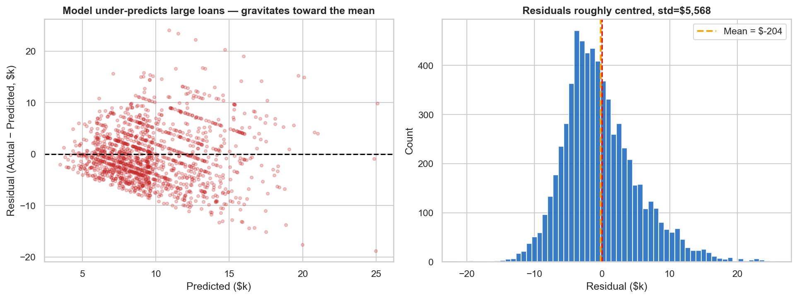
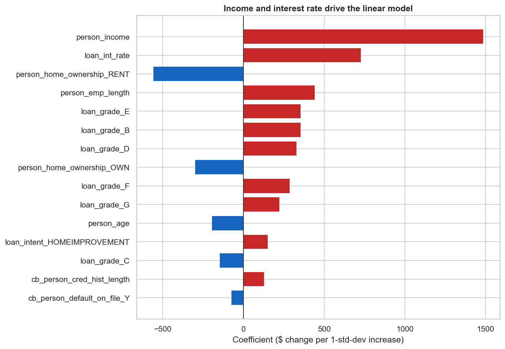

# Loan Amount Prediction Using TensorFlow

> Given a borrower's credit profile, predict the loan amount they are likely to be approved for — trained on 32,581 real credit records, deployed as a TFLite model in a Flutter mobile app. Best result: **RMSE $5,571 · MAE $4,314 · R² 0.230**.


---

## Origin

This was my first financial ML project, built early in my Data Science and Machine Learning journey while I was exploring TensorFlow and Flutter together. The idea was straightforward: take a real credit dataset and build something end-to-end — from raw data to a model running on a mobile phone. Finance felt like the right domain to start with because the predictions are grounded in real numbers that mean something ($5,000 is not the same as $30,000), and deploying to Flutter via TFLite meant I had to think about the full production path, not just a Jupyter notebook.

Started with binary classification on `loan_status` — a natural starting point when getting into credit risk. Over time I got more interested in the regression side: predicting the actual dollar amount felt more useful and more challenging than a simple approved/rejected label. That shift, and everything I learned along the way, is what this repo documents.

---

## The Problem

When a borrower applies for a loan, the lender needs to assess not just whether to approve it, but what amount is reasonable given the applicant's profile. This model takes inputs like income, employment history, loan grade, and loan intent — and predicts the likely loan amount.

This is a **regression problem**. The target is a continuous dollar value. Predicting it from credit features alone is genuinely hard, and the R² reflects that honestly.

---

## Dataset

- **Source:** [Credit Risk Dataset (Kaggle)](https://www.kaggle.com/datasets/laotse/credit-risk-dataset)
- **Currency:** USD (United States Dollars)
- **Size:** 32,581 rows × 12 columns
- **Target:** `loan_amnt` — continuous, range **$500 – $35,000**, mean $9,589
- **Key input features:** `person_income`, `loan_grade`, `loan_intent`, `loan_int_rate`, `person_home_ownership`

---

## Approach & Key Decisions

**Why regression, not classification?**
The project predicts the loan *amount* — a continuous dollar value. The Flutter app confirms this: it takes a borrower profile and outputs a dollar figure. Binary classification (default/no-default) is a different problem entirely.

**Why drop `loan_percent_income`?**
It equals `loan_amnt / person_income`. Keeping it would let the model reconstruct the target from income trivially — perfect-looking results that collapse on real data.

**Why drop `loan_status`?**
Default status is only known after the loan is issued and the repayment period ends. It doesn't exist at application time, which is exactly when you'd want to predict the loan amount.

**Why scale the target y?**
Loan amounts range $500–$35,000. Unscaled MSE produces loss values in the hundreds of millions — gradients explode and training diverges. Scaling y to mean≈0, std≈1 fixes this completely. Predictions are inverse-transformed back to dollars after inference.

**Why Logistic Regression is not here?**
This is regression. The baseline is a `DummyRegressor` (predicts the mean every time) and `LinearRegression`.

---

## Results

| Model | RMSE | MAE | R² | MAPE |
|-------|------|-----|----|------|
| Dummy (predicts mean $9,589) | $6,347 | $4,919 | 0.000 | 92.0% |
| Linear Regression | $5,916 | $4,586 | 0.131 | 85.1% |
| **Neural Network** | **$5,571** | **$4,314** | **0.230** | **77.5%** |

The neural network explains 23% of loan amount variance — a genuine improvement over both baselines, but modest in absolute terms. The reason is honest: **loan amount is borrower-chosen**. Someone with a $60k income applying for home improvement might want $3,000 or $28,000. The credit profile features in this dataset measure *risk capacity*, not *borrowing intent*. That gap is what limits R².

**Prediction accuracy brackets (Neural Network):**

| Tolerance | Predictions within bracket |
|-----------|---------------------------|
| ±10% | 13.2% |
| ±20% | 25.5% |
| ±30% | 38.5% |
| ±50% | 60.7% |
| ±75% | 80.2% |

For a $10,000 loan, ±30% means the model predicts somewhere between $7,000 and $13,000. Useful as a first-pass estimate — not a definitive approval figure.

---

## Key Visualizations

### Actual vs Predicted


### Residual Analysis


### Feature Importance (Linear Regression Coefficients)


---

## What Didn't Work

**Challenge 1 — The original code was solving the wrong problem**
- **The Problem**: The Python notebook in the original repo trained a binary classifier predicting `loan_status` (0 or 1). This contradicted the project title, the Flutter app UI, and the intended use case. The two were never in sync.
- **What I Tried**: Initially kept classification framing. The Flutter output of values like 550,034.9 (impossible for a sigmoid output bounded to [0,1]) confirmed the original Flutter model was a regression model.
- **What Worked**: Rebuilt everything from scratch as regression — `loan_amnt` as target, linear output activation, MSE loss, RMSE/MAE/R² metrics. The notebooks, src scripts, and README now match what the Flutter app actually does.

**Challenge 2 — Scaling the target was non-obvious**
- **The Problem**: Loan amounts range $500–$35,000. Training the NN on raw dollar values produces MSE loss in the hundreds of millions. Gradients were enormous and training diverged on epoch 1.
- **What Worked**: StandardScaler on both X and y. Loss dropped to a normal 0–1 range and the network converged cleanly in ~25 epochs. The inverse-transform step in inference is critical — never display the raw scaled output to a user.
- **The Result**: Stable training, early stopping at epoch 25, smooth convergence curves.

**Challenge 3 — R² of 0.23 looks bad without context**
- **The Problem**: R² of 0.23 means 77% of variance is unexplained. Reported without context, this sounds like model failure.
- **What I Investigated**: The highest feature correlation with `loan_amnt` is ~0.34 (person_income). The fundamental issue: this dataset was built for risk scoring, not loan sizing. Features like "what renovation is planned" or "what medical procedure" would let the model distinguish a $3,000 request from a $30,000 one — but those features don't exist here.
- **Conclusion**: The model captures the real signal available. The low R² is a data limitation, not a modeling one.

---

## Known Limitations & Valid Input Ranges

**The demo video uses inputs that are outside the training data range.** The input loan amount of 500,000 and the output of 550,034.9 shown in the original demo are 14× above the maximum value seen during training ($35,000). The model extrapolates wildly at those values — the output is noise, not a prediction.

For the model to produce meaningful results, inputs must stay within the training distribution:

| Feature | Valid Range | Notes |
|---------|------------|-------|
| `person_income` | $10,000 – $500,000 | Annual income, USD |
| `loan_int_rate` | 5.4% – 23.2% | Typical range in dataset |
| `person_age` | 20 – 65 | Dataset has outliers up to 144 — model unreliable above 65 |
| `person_emp_length` | 0 – 41 years | Outliers above 60 exist but are data errors |
| `cb_person_cred_hist_length` | 2 – 30 years | — |

**What this model does not do:**
- It does not determine loan approval — only estimates a likely amount
- It does not account for current economic conditions or lender-specific policies
- It is not calibrated for use outside the US (dataset is USD, US lending context)
- Predictions outside the training distribution ($500–$35,000 loan range) are unreliable extrapolations

**Why R² is 0.23 and not higher:**
Loan amount is primarily what the borrower *chose to request* based on their personal need. The features in this dataset (income, grade, history) measure creditworthiness, not borrowing intent. A model with access to purpose-specific features (renovation scope, medical procedure cost, debt schedule) would significantly outperform this one.

---

## Experiment Log

| # | Experiment | Change | RMSE Before | RMSE After | Decision |
|---|-----------|--------|-------------|------------|----------|
| 01 | Dummy baseline | Predict mean ($9,589) | — | $6,347 | Benchmark |
| 02 | Original Python code | Binary classification of loan_status | N/A | Wrong task | Rejected |
| 03 | Switch to regression | Target = loan_amnt, linear output | $6,347 | $5,916 (LR) | Correct task defined |
| 04 | Drop loan_percent_income | Remove leaky feature | $5,916 | Cleaner model | Kept |
| 05 | Scale y with StandardScaler | MSE stabilised | Training diverged | Converges | Kept |
| 06 | Add BatchNormalization | After first two Dense layers | Unstable | Stable | Kept |
| 07 | Add Dropout (0.3, 0.2) | Regularisation | val RMSE $5,650 | $5,571 | Kept |
| 08 | Final Neural Network | All fixes combined | LR $5,916 | **$5,571** | Deployed |

---

## What I'd Do Next

1. **Add loan-purpose-specific features** — the single biggest R² bottleneck. Medical loan amounts depend on procedure costs; home improvement loans depend on property value. None of this is in the dataset.

2. **Try gradient boosting** — XGBoost / LightGBM typically outperforms neural nets on tabular regression. The TFLite deployment requirement drove the TF choice, but a comparison is worth running.

3. **Output prediction intervals** — instead of a point estimate, give a range (e.g., "$8,000–$14,000"). Quantile regression or conformal prediction would make the app output genuinely more useful and more honest.

4. **Fix input validation in the Flutter app** — clamp all inputs to the training distribution before inference. The original demo fed 500,000 as a loan amount and got 550,034.9 out — valid inputs would have produced sensible results in the $2,000–$25,000 range.

---

## Model Card

- **Task:** Regression — predict loan amount (continuous, USD)
- **Intended Use:** Rough first-pass estimate of likely loan amount given borrower profile. Should be used as a bracket, not an exact figure.
- **Not Suitable For:** Loan approval decisions, legal or regulatory compliance, deployment without input range validation, any currency other than USD.
- **Training Data:** 32,581 US credit records. No date information — temporal validity unknown.
- **Performance:** RMSE $5,571 · MAE $4,314 · R² 0.230 on 20% held-out test set.
- **Known Limitations:** Explains only 23% of target variance. Under-predicts large loans (>$20k). Unreliable outside $500–$35,000 loan amount range.

---

## How to Run

```bash
git clone <repo-url>
cd Loan-Amount-Prediction-Using-TF-main
pip install -r requirements.txt

# Run notebooks in order
jupyter notebook notebooks/01_eda.ipynb

# Or run the full pipeline directly
python src/train.py --data data/raw/credit_risk.csv --out outputs/models
python src/evaluate.py --models outputs/models --data data/raw/credit_risk.csv

# Run tests
python -m pytest tests/ -v
```

---

## Project Structure

```
Loan-Amount-Prediction-Using-TF/
├── data/
│   ├── raw/                    # credit_risk.csv — 32,581 records, USD, $500–$35,000 loans
│   └── processed/              # Scaled train/test splits + scaler objects
├── notebooks/
│   ├── 01_eda.ipynb            # Distributions, correlations, honest assessment of signal
│   ├── 02_preprocessing.ipynb  # Imputation, encoding, why loan_percent_income is dropped
│   ├── 03_modeling.ipynb       # Dummy → Linear Reg → Neural Net, training curves, TFLite
│   └── 04_evaluation.ipynb     # RMSE/MAE/R², residuals, error analysis, limitations
├── src/
│   ├── preprocess.py           # load_and_clean(), engineer_features(), get_splits()
│   ├── train.py                # Full training pipeline — all three models
│   └── evaluate.py             # Regression metrics, actual vs predicted, residual plots
├── outputs/
│   ├── figures/                # All plots (actual vs pred, residuals, feature importance)
│   └── models/                 # best_nn.keras, scaler_X.pkl, scaler_y.pkl, LR model
├── flutter/                    # Flutter mobile app — TFLite inference on-device
├── tests/
│   └── test_pipeline.py        # Pipeline sanity tests
├── requirements.txt
├── .gitignore
└── README.md
```
